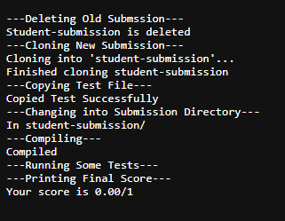
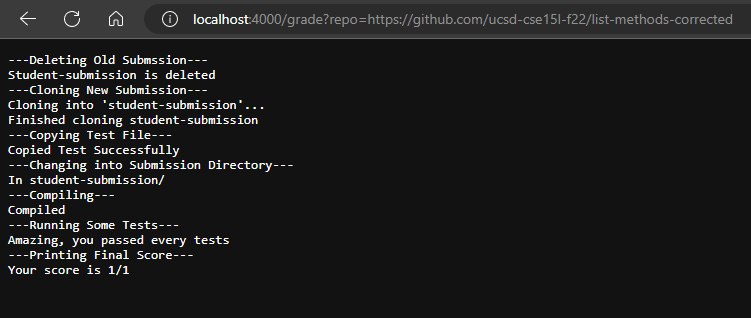
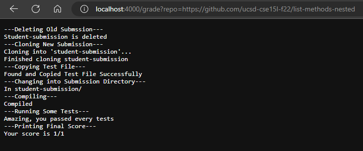

# Lab Report 5

## **Grade.sh**

```
1 # Create your grading script here
2
3 # set -e
4
5 # Setting variables
6 TOTAL_GRADE=0
7 CP=".:$PWD/lib/hamcrest-core-1.3.jar:$PWD/lib/junit-4.13.2.jar"
8
9 echo "---Deleting Old Submssion---" #I got this idea from kNelaconda
10 # Delete old student-submission
11 if [[ -e student-submission/ ]]; then
12     rm -rf student-submission
13     echo "Student-submission is deleted"
14 else
15     echo "Student-submission doesn't exist, proceed to Cloning"
16 fi
17
18 echo "---Cloning New Submission---"
19 # Cloning student submission
20 git clone $1 student-submission
21 echo "Finished cloning student-submission"
22
23 echo "---Copying Test File---"
24 # Copying my tests to the student submission directory
25 if [[ -e student-submission/ListExamples.java ]]; then
26     cp TestListExamples.java student-submission/
27     echo "Copied Test Successfully"
28 else
29     find student-submission -name "*.java" | xargs -I % cp % student-submission/ | cp TestListExamples.j    ava student-submission/
30     echo "Found and Copied Test File Successfully"
31 fi
32
33 echo "---Changing into Submission Directory---"
34 # Change into the student submission directory
35 cd student-submission/
36 echo "In student-submission/"
37
38 echo "---Compiling---"
39 # Compiling all the java files
40 javac -cp $CP *.java 2> stderr.txt
41 if [[ $? -eq 0 ]]; then
42     echo "Compiled"
43 else
44     echo "Failed to compile"
45     TOTAL_GRADE="Your total grade is: 0/1"
46     echo $TOTAL_GRADE
47     exit $?
48 fi
49
50 echo "---Running Some Tests---"
51 # Run the Test file
52 # If all tests passed, grade = 100%
53 java -cp $CP org.junit.runner.JUnitCore TestListExamples 1> stdout.txt
54 if [[ $? -eq 0 ]]; then
55     TOTAL_GRADE=1
56     echo "Amazing, you passed every tests"
57 else
58     TESTS_RAN=$(grep "^Tests" stdout.txt | cut -d " " -f 3 | cut -b 1) #Getting the number of ran tests. 59     TESTS_FAILED=$(grep "^Tests" stdout.txt | cut -d " " -f 6) #Getting the number of failed tests.
60     TOTAL_GRADE=$(printf %.2f "$((10**2 * ($TESTS_RAN - $TESTS_FAILED) / $TESTS_RAN))e-2") #Final version
61 fi
62
63 echo "---Printing Final Score---"
64 # Print student's submission final score
65 printf "Your score is $TOTAL_GRADE/1\n"
```

## **Grading Student's Submission**

### *First Submission*:



    This is the grade of the first submission, the original unfixed lab 3 file.

### ***Second Submission***:



* The standard output of the echo command is just `---Deleting Old Submission---`
* The result of the *if* statement on line 11 is true because I had been testing my grade script, so there is already a "student-submission" in my repository, so the program found and delete it.
* The standard output of the next echo command is `---Cloning New Submission---`
* For the git clone command, the standard output of this would be the process of it cloning the student's submission repository down to your local computer and the standard error would be if you didn't include a link to the repository.
* The standard output of the next echo command is `Finish cloning student-submission`.
* Then, I echo `---Copying Test File---` indicating, the next step is copying the test file into the "student-submission" directory.
* The result of the *if* statement on line 25 is true, there is only 1 case where that statement is false and that is in the case of the third submission. Because there is a **ListExamples.java** file inside of the "student-submission" directory, I will copy the test file into the "student-submission" directory. Finally, I echo `Copied Test Successfully`.
* Next, I change into the directory of the "student-submission". The standard error of this command is something that says `student-submission doesn't exist`.
* After successfully changing into the student-submission directory, I echo that I'm currently `In student-submission/`.
* I move onto to compiling all the java files to prepare for testing. Before compiling I echo `---Compiling---`.
* The standard output of the *javac* command is nothing because it means it has successfully compiled which is what happened in this submission. If it doesn't compile, then it would display the errors in the stderr.txt file. Therefore, the *if* statement is true.
* Because the file compiled, I moved onto testing. First I echo that I will be `---Running Some Tests---` on the ListExamples.java file.
* On the next command, the *java* command, I run the TestListExamples file to test the methods in the ListExamples file. All the tests passed, so it will push the result into the standard output text file and that means the result of the *if* statement is true.
* Because the *if* statement is true, it will sets the variable **TOTAL_GRADE** to **1** and echos a message congrating the student `Amazing, you passed every tests`.
* The last part is printing the final score that the student will receives, so I echo to tell the student that this part is `---Printing Final Score---`.
* Finally, the *printf* command is for printing. The standard output of that would be the expected result which is a message that says "Your score is **1**/1". The standard error of this would be something like the `syntax is incorrect` or `command not found`.

### *Third Submission*:



